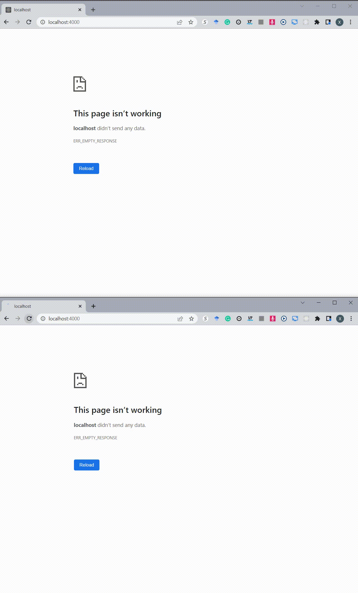
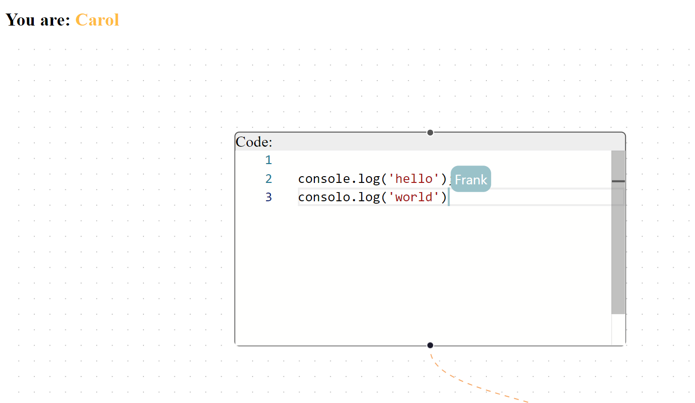

# A demo to share editing on Monaco-based graph flow




## Build

### Use Docker

mount this folder with the `app` and port `4000`

```
docker run -it --rm -v <your-path->sharing-edited-monaco-flow:/app -p 4000:4000 -u 0:0 node:18
```

### Install Packages

Attach a shell to the running container and:

```
cd app
yarn 
```

### Launch a WebSocket Server

```
PORT=1234 node ./node_modules/y-websocket/bin/server.js
```

### Launch the Demo Website

```
yarn start
```

Then you can visit it on http://localhost:4000/


## Todo

- too slow (because it renders all reactflow element every time if any movement occurs)
- display awareness info (which user is editing now?)

### Progress

Awareness: can show cursors in different colors and display the associate user name when you put your cursor on in a code editor.



But it is still too slow and too ugly to inject styles for each `clientID` every time.