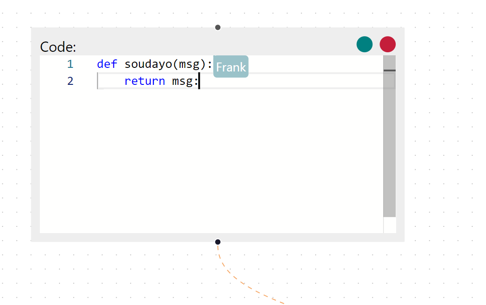
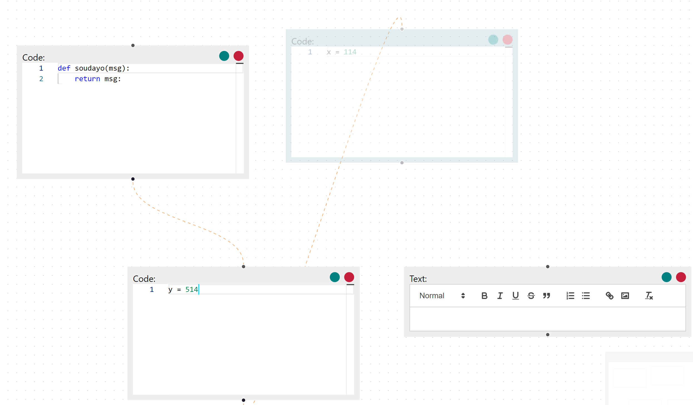
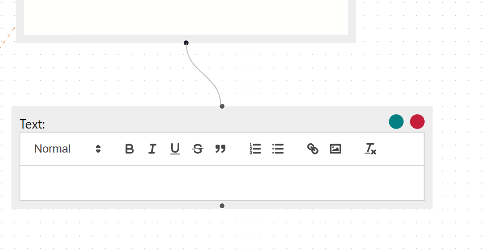

# A demo to share editing on Monaco-based graph flow

## Build

### Use Docker

mount this folder with the `app` and port `4141` and `5555`

```
docker run -it --rm -v <your-path->sharing-edited-monaco-flow:/app -p 4141:4141 -p 5555:5555 -u 0:0 node:18
```

### Install Packages

Attach a shell to the running container and:

```
cd app
yarn 
```

### Launch a WebRTC Server

```
PORT=5555  node ./node_modules/y-webrtc/bin/server.js
```

### Launch the Demo Website

```
yarn start
```

Then you can visit it on http://localhost:4141/ and you'll be assigned to a user name/color randomly

## Usages:

### Collaboration in editors:

Edit code in a code editor, other user can see your update and your name will be displayed when they move their mouses to your remote cursor on their side:



### Change editor positions and add new connections between them:

A user can only move an editor by dragging the green button on the top-right. When a editor is being dragging, other users can see the track and corresponding user color on their side in real-time.



You can also connect two editors by dragging a line from one to the other:



### Add and delete code/text editors:

You can delete an existing editor by click on the red button on its top-right.

To add a new editor, you can right-click on any place on the pane and choose the editor type, then it will create a new editor in place.


## Todo

- [ ] Notice that we use the WebRTC server as our source of truth, if the server is shut down, no info can be recovered next time you start the web. We should build our backend with a database.
- [ ] Resize the code editor.
- [ ] Some bugs in Quill text editor when combined with reactflow. Use other rich-text editors in the future.